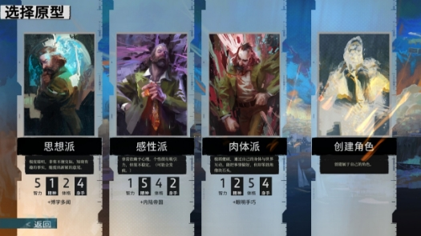
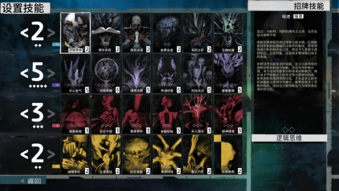
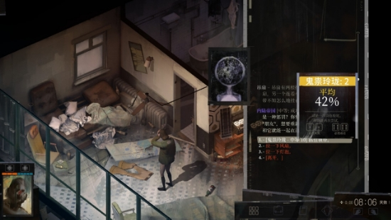
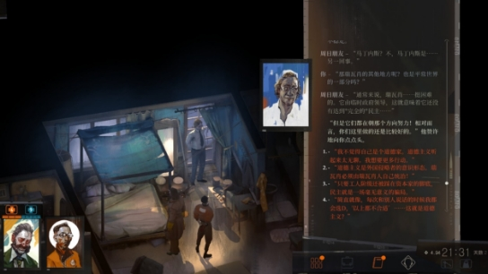
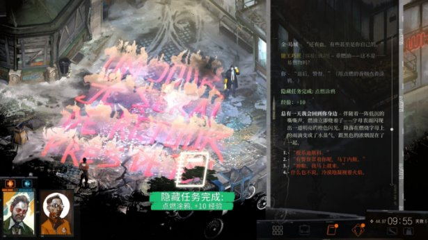
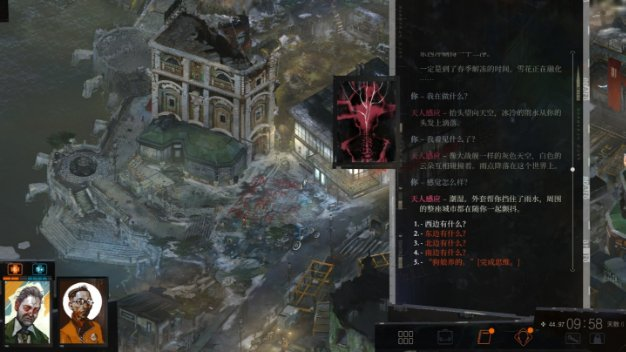
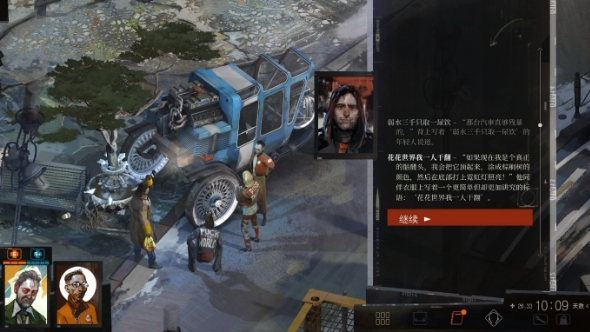
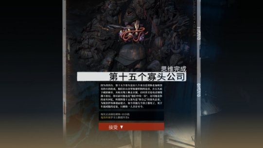
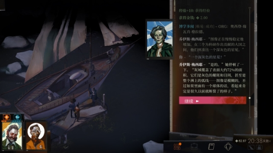

简单地介绍一下游戏的背景设定。作为一个失忆警探，你需要做的是在苏醒以后，和前来接应你的 金 ·曷(he)城 警官合作，侦破位于旅社后面的吊尸案。在破获案件的过程中有大量的支线案件可以选择性完成，这些支线像一张蜘蛛网一样围绕在主线上，对主线产生各种各样的影响。游戏以对话和搜索为主进行推进，以天数为单位，总游戏时长在10-20小时内。

3-30更新了final cut导演剪辑版，增加了少许内容。此外，在第四天早上会进行一项判定，在你的某项思想点数达到了4以后便可以开启某种思想的支线，去寻找马丁内斯与你志同道合的人，因部分法律法规此处不予详述，可以去试着自己探索。

\----------

与常见RPG游戏不同，这个游戏没有日常大家所见到的“传统” “战斗”内容。游戏内加入了鲜明的跑团要素，剧情中没有手操战斗，完全依靠骰子roll点来决定结果。在游戏开始时，系统会给予玩家12点点数，可自由分配到智力、精神、体格和身手四个大属性上。游戏为玩家预设了三种警探风格，当然也可以自行搭配，比如4个3的完全均衡派。不必担心这样的搭配会在遇到点数判定时失败，对于此类roll点游戏，失败是常有的事，更何况这个游戏提供了不止一种达成某项目的的方法和路径；换句话说，不管怎么分配点数，最终都能通关。

关于这一点，我想先聊一下《辐射》系列。1、2和新维加斯都由黑曜石工作室设计完成。在这几款游戏上有着类似的特点，游戏为玩家角色附加的点数是真实有效的，会生动地表现在游戏中。一个精神能力高的人擅长沟通，一个体格健壮的人能更好地使用武力；在我看来，这样设计的游戏显然更加贴近现实，能帮助玩家更快速地产生真实感，更好地进入“心流”状态。

\------------------------------------------------------------

现在回到这款游戏。每个大属性下都下设了6个子技能，分配到大属性的点数就是各个子技能的基础等级，同时也限制了子技能的提升上限。 这些属性和技能会以各自的方式影响你的游玩过程和体验：一个精神高的角色可以轻松看穿他人心声，掌握场合气氛，依靠精神威压逼迫他人说出真相；一个智力优秀的警探可以通过自己的学识、思维和口才快速破获案件；体格健壮的警探可以用自己的肌肉暴力通过阻碍；而身手敏捷的警探可以轻松越过障碍，在关键审判下抢夺先机。不同的技能等级可能会导致你对同一个案件获取到不同的信息，也有可能导致你主动或被迫要进行不同的支线。

除此之外，部分技能在对话时可以以内心独白的形式为你提供帮助，与他人对话遇到难题，又或者是缺少线索无法推进时，这些技能可以帮助你出谋划策，或是猜测对方的心理活动。此外，钢筋铁骨和平心定气较为特殊，这两个技能相当于你的生命和士气，这两者在游戏中作为“生命条“存在，其中一个归零则游戏结束；过度的忽略某属性，可能导致你的角色生命低，一旦遇到事件就面临危机。当然，游戏中也提供了应急药物。

就如前面所述，游戏中基本没有考验手操的地方，绝大部分都由对话推动。相比于手速，游戏更考验你的阅读能力和手气。

在对话的过程中，会出现被动检定和主动检定两种用来判断剧情走向的判定。

在对话时，如果“继续”字样由红色变成彩色，那就代表接下来对话需要进行某项技能的被动检定。计算方式是玩家的当前数值+6，比对条件。检定成功，则能获得一些信息，检定失败，什么都不会发生。

主动检定则直接出现在接下来的对话树中，可以自行选择是否进行判定（某些情况下必须做出选择，错过就没有机会）；此外，主动检定还分为白色检定和红色检定；红色检定表示该选项是不可逆的，它会影响接下来的剧情；白色检定则是游戏的难度修正机制；一次失败，可以选择想办法堆高属性再次检定；多出现在一些无关紧要的位置。作为一个跑团游戏，如果你选择了玩它，那表示你也应该接受“不是一切都能如你所愿“这件事。

游戏开局分配的点数有限，游戏中也没有什么能够永久增加属性的方法；但游戏提供了烟酒 药品等能短时间提高属性的道具，和穿上以后能够增强某项技能但也有负面作用的各项服装。在进行检定时，可以提前换上对应的服装，吃对应成瘾品来暂时性提高某项能力，从而提高检定成功的机率。

需要注意的是，对于这款游戏，并不是所有点数满值就意味着天下无敌。任何一个属性过高都会导致这种思想负面占用你的思绪，两种人格特性间还会互相吵架，干扰你的选择。并且对于那些需要十几点乃至20点才能通过的判定面前，玩家依然只是一个普通人，只是成功的概率大了点。

此外，尽管属性无法永久提升，但技能可以。每当进行一些特殊对话，或者完成任务，都能累计经验以获得技能点。技能点可以用来增强一个技能、解锁一个思维槽，或者遗忘一个思维。

除过独特的加点和判定，游戏还额外增加了一个名为“思维阁”的加成系统：在游戏中，玩家扮演的是一个失忆的侦探，在探案的过程中自己的人格也不断复苏。选择不同对话有可能在你的脑海中突然迸发出一些新念头，这些思维会暂时存在于脑海中；玩家可以选择性地仔细琢磨一些思维，用自己的思维去解答自己的疑问，将其内在化，作为自己人生的一部分。不同的思维在诞生时和完成时都会有不同的增益和减益效果，可以根据自己的需求和爱好进行琢磨。

尽管思维阁在游戏中的存在意义是为了给玩家增加额外的技能和点数，但制作组依然很用心地让每一个思维都有了自己的实质意义。在一个思维出现时，它会向你提出实质的问题，而在思维琢磨完成以后，你又会从自身的思考中得到解答，帮助玩家更好地沉浸于游戏中。

此外还有一个值得一提的设计.尽管游戏中并不限制你的所作所为，但你所做出的各种行为都会被记录下来；就记录在档案的右侧。不同的选项暗示你内心支持什么样的想法，但尽管如此，游戏本身并不会加以批判或是赞扬，作为玩家，我们应该认识到这只是个游戏，不要因此而在做选择时畏手畏脚，去做自己想要宣称的行为。

这是一个非传统的游戏；于其说它是一个RPG游戏，倒不如说它更像是一部小说，或者文字冒险游戏。它描述的是一队警探的探案经历，但游戏的背景，人们的精神面貌乃至对话无不展现的是这个时代的精精神风貌。具体的内容和游戏有着密不可分的联系，有兴趣的人可以自己去尝试着玩一下。后文有游戏的一些操作技巧和注意事项，如果不想玩的话也可以直接查看最后的剧透。此外，记录的数值达到某个数字以后还能解锁新的思维可用，至少冲着这点也值得多试试各种选项。

\------

游戏整体风格严肃，玩家在游戏中不仅仅在拾回自己的过去，也是在认识制作组构建出的世界。尽管如此，游戏还是加入了不少的幽默桥段，而游戏又会将它神秘的一面在你惆怅时一鼓展示出来。单纯的图片难以表现其效果，还是要自己去游玩才能感受到其魅力所在。

\----

一些游戏的提示，可能涉及剧透，但掌握以后可以帮助你更好地体验剧情：

1\. 绿色球体不要着急点，在码头和游艇上的野松公司代表谈话，可以获得“第十五个寡头公司思维”；每点击一个绿色小球，都可以获得0.1雷亚尔；后期在菲尔德大厦前和父子交流，可以解锁思维“三教九流中心”，每次进行博学多闻的检定时都可以获得2雷亚尔和经验；解锁这两个思维到后期完全不愁吃住。

2\. 没事的时候装备上撬棍，有的货物只能撬开；此外装备塑料袋时，可以捡地上的空瓶回收卖钱。平时多按tab或者鼠标右键，可以查看当前摄像机范围内还有哪些可互动的元素，到处都有零钱可以收集。

3\. 根据你的点数差异，决定自己是要尽快和工会联系还是推迟和工会联系。取下尸体有两种方法：自己射下来和找工会帮忙。取下尸体并验尸以后身上会有臭味，需要洗澡，旅馆每天都需要20雷亚尔，渔村不能洗澡，因此早点完成尸检可以省钱。要进入工会有两条路，如果不想接受测颅先生的思想，可以从坤诺的小屋走小路爬上去，但是一旦爬上去以后就无法再回头直到沟通完成。此外，最好在进入工会前完成尸检，找到“弹头”，这会很大程度影响对峙。当然不拿也可以，毕竟这只是一个游戏，各种可能都可以去试试。

4\. 有的任务不是必须完成，还有很多隐藏任务如果你不去试图开启连出现都不会出现。游戏时间只随着新对话推移，闲逛不消耗时间；每天9点后NPC就开始休息，到凌晨2点后今日时间停止流动。

5\. 游戏最后会对你进行评判，想做什么就去做，不想做就不做，完成某些任务可能反而会让你不满意游戏的最终评价。但是部分任务有时间限制，建议合理规划时间；不着急的任务可以等到晚上9点以后全做，读书可以晚上回房间以后一个人读。

6\. 游戏中部分任务存在硬性的时间节点，会影响其他任务的进程；游戏中会通过文本暗示你一段任务做完后就无法回头；如果想要做支线，那在主线推进到一定程度后先去完成支线。

7\. 开局第一天会要求你赔偿旅社130雷亚尔的损失，可以通过逃跑检定减少30元；如果找不到也没关系，可以去收钱，比如公司代表和集装箱富翁处；实在不想当黑警，曷城警官也会帮你偿还第一天的钱。

8\. 和其他人对话的时候多点一些额外的无关内容，对话前多找找相关线索和话题，roll点检定的时候会有额外加成，但是偶尔也会有削弱。

9\. 第三天渔村开放以后，可以选择住在渔村，不再需要给旅社掏钱。

10\. 如果想要收集全套盔甲，首先需要尽快完成尸检，其次需要金不在你的身边，此外还需要和坤诺沟通，解锁“获取全套盔甲”和“获取靴子”两个任务。此时才能从吊人身上拿到靴子并清洗。拿到3件盔甲并穿上可以解锁特殊思维，以后有用。

11\. 和提图斯兄弟沟通时，最好拿到了子弹、古董、旅馆后的弹球工坊、脚印、射击位置这几个证据，可以更方便地压制他们；对话时仔细阅读来自人格的提示，它们能帮助你找到线索；同时这里如果失败了有概率直接BE。在这一点上，精神属性高的玩家有优势。

12\. 资方代表的任务“私刑”有一个bug。这个任务有两种判定通过条件：给她查看你的警徽，或者帮他查清堵车原因。如果先接了堵车这个条件，那么你之后找到警徽给她看也没用了。

13\. 如果想做教堂支线，记得先去找公司代表了解“灰域”的概念。

\----

以下内容是为不想玩游戏的人准备的，涉及剧透

《极乐迪斯科》游戏由小说改编而来。故事背景乍看起来和我们现实中xx剧变后的东欧类似，这片土地经历了xx，xx之后，现在成了人道主义下的三不管地区。但我在阅读更详细文档后发现游戏所描述和现实还是有所差别。

在小说和游戏的世界观中。这个世界的71%被一种叫做“灰域”的物质（不是海洋）笼罩着。人们不知道这种物质究竟是什么，因为仪器很难进行探测，它就是纯粹的“虚无”，至少在人类看来是这样的。而人类呆在灰域中会很快迷失自我，彻底消失，船只和飞机也只能快速通过，否则也有消失的风险。按照游戏的描述，它就像是一种人类历史思维和想法的集合体。就是因为灰域，整个世界被切分为了7块不同大小的大陆和岛，诞生了不同的国家。更糟糕的是它随着时间似乎还在不断地扩大，因此游戏中，玩家操作主角大喊“末日来临“也并不是毫无依据。在“教堂”和“要塞事故”支线中，这一点也能得到佐证。

对于灰域，整个游戏的描述少之又少，个人认为，“灰域”可能是一个暗示或者多重含义。第一层意思是指游戏中存在的这种“虚无”，第二层是指人类意识形态之外尚未探索到的位置。

`	`

玩家在游戏中是一个失去了身份、失去了记忆，喝酒喝到断片，满脑子就剩下旧时代迪斯科的警探，就连名字都没能想得起来，只能靠同僚和他人帮忙来尝试找回。即使是这样，主角依然还保留了一些他的警探能力，还能像一个开罐器一样，狠狠撬开证人和罪犯的嘴。

在游戏的开始，金 曷城警官会提醒你去开始验尸的工作。在验尸的过程中会陆续碰到坤诺兄妹、卡拉洁（受害者，同时也是另一商业案件的间谍）、提图斯七兄弟等人。他们都为这起案件的推进提供了重要线索。

经过一系列调查和审问，你可以确定：被杀死的是野松公司派来的雇佣兵，而他们前来马丁内斯的原因是这里的港口工会索要更高的福利，进而关闭了闸门，导致货运司机无法卸货；公司派出代表来试图谈判，却被拦截在海岸上；这些雇佣兵前来试图解决这一问题。当你走出旅社时，会看到罢工的司机工会和要求恢复工作的工贼（公司派来的内鬼）吵作一团。在验尸的过程中，你还会详细了解到drug案、工会x工等案件，你可以按照自己的喜好在这些人中间扮演一个角色，在不同势力与派系间周旋；你可以选择做一个commi主义者，也可以做一个nationalism主义乃至自由主义者，你甚至不知道为什么同时支持这几种思想；这些行为和选择会影响你的游戏体验；但是，殊途同归，你最后要做的都是破获吊尸案。

在解决吊尸案时，如果你和坤诺达成一致，那么坤诺会告诉你一些有关吊人的信息；同时他也是帮助你推进剧情的关键人物。如果你能靠自己卸下尸体，那么即刻就可以验尸；但如果你没能靠自己取下尸体，就只能依靠港口的工会，不可避免的要卷入工会和公司的对峙。要进入工会，除了选择正面迎战测颅先生，接受他的思想；也可以选择从坤诺的小屋溜入港口。

进入第二天后，旅社的包间会被启用，里面坐的是提图斯兄弟；他们受工会的指派前来沟通。由于玩家所在的“瑞瓦肖”小城长期处于三不管地区，RCM有在此处存在管辖权的争议，是公会在这里充当了类似警察的角色。而在他们眼里，以主角为例的RCM就是xx养的手下。在和提图斯兄弟对峙的过程中，主角会从他们嘴里得知提图斯兄弟还有一人并未出现，而她有很明显的犯罪嫌疑。

进入第三天后，水坝修复后，主角可以在左侧继续寻找疑似凶手；进入菲尔德电气大楼后，就能看到这个嫌疑人露比。在和他对峙的过程中，你可以破坏扩音机，让他自裁。也可以选择放他一马。她的日记中会写明她是无辜的，真正的凶手另有其人。

当你完成了这一章节之后，再回到旅社就会遇到游戏中最惊险的一次事件：吊人是雇佣兵的一员，而他的同伙早已按耐不住要让提图斯兄弟乃至整个港口负责，因为目前的证据都指向了他们，而只有你能确定凶手与他们无关。这里的一系列判定会影响你的结局和受伤人数，之前在尸检和四处乱逛时获取的证据信息能够帮你提高成功率，收集其盔甲也有额外加成。期间有多个高难度判定；如果运气太差，可能金警官也会重伤被带走，此后的剧情他不会再出现。而你必定中枪，直接晕死过去。再次醒来已经是两天后了；港口会封闭，部分未完成的任务（如昆虫学家的任务、工会的任务）也将不能再完成。而在完成了这一切后，地图的最终章，小岛也会向主角开放。

在最后的小岛上，主角会遇到真正的凶手，他是公社留下的最后火种，一个人在小岛上苟活到了现在；当他那天晚上看到雇佣兵和女间谍时，是他扣动了扳机。

瑞瓦肖是一座曾经充满荣誉与美好的城市。然而后来却陷入了战乱，国际组织以和平的名义向这里派遣了军队,与曾经的工会激战。现在的瑞瓦肖像是一片废墟，普通人只是艰难地生活在这片土地上。游戏中主角所在的阵营简称RCM，类似于瑞瓦肖警署，但却带有义务性质，又和外国有着丝缕联系，因而在瑞瓦肖主角并不是完全具有警察的权威。而主角在找回过去的过程中发现自己的种种劣迹，又让他在当地人和同僚间失去了作为荣誉警探的荣耀。

作为让主角失去记忆的重要原因，如果你选择在左侧小岛的木板道上打电话，多次打电话以后，你会听到一个对主角来说熟悉而又陌生的声音。她和主角在6年前就已经分手，她现在住的地方和主角有6小时的时差。主角在牛仔裤中找到的杏子味口香糖和翻看案件簿时的剧痛，无不暗示着什么才是让主角沉迷酒精，四处撒泼的原因。但这次喝到断片直至失去记忆的经历反而让主角能暂时摆脱痛苦，重新审视自己的人生。尽管痛苦让他沉沦，让他失控，但失忆后却仍然记得迪斯科，或许这是能让他暂时忘掉伤痛的唯一工具。

如果你在瞭望台那里选择睡觉，在梦中能见到那个让主角魂牵梦萦的人：他的前女友，在现实中他们早已分手多年。但主角的梦中，她与无罪女神德罗丝黛的形象被混杂在了一起，主角会与她在梦中见最后一面。

每天晚上睡着以后，主角自己的精神都会以主角大脑和潜藏的“爬行动物脑”的身份和主角对话；尽管主角失去了记忆，但他的潜意识并没有；每每和自己对话，都令主角感到痛苦。在游戏的末尾，正式向凶手提出逮捕令之后，旁边的芦苇荡中会传出声音，而你靠近以后就会发现那对神秘昆虫学家所说都是真的，这个世界上真的有伊苏林迪竹节虫!更令人惊奇的是主角能与其对话，但主角真正对话的是谁？是竹节虫，还是主角自己，又或者是主角的“爬虫脑”。但是这不重要了，主角真的找到了这只神秘动物，而他的新人生也要开始了。

在游戏的结局审判，玩家的原配搭档和现有搭档会对主角的所作所为进行一次细致的评定，自此游戏结束。
